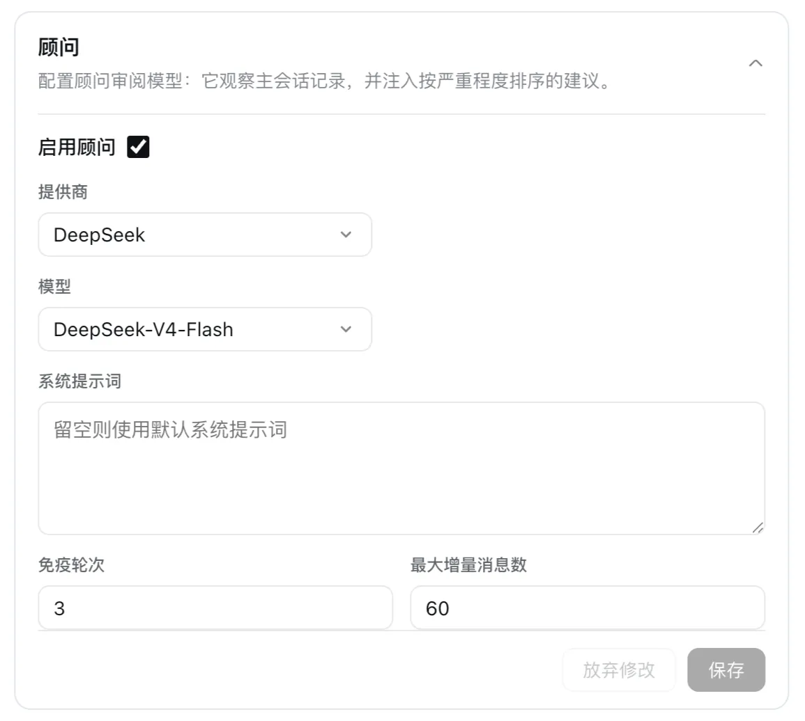

# dsh-advisor

English | [中文](README.zh.md)

[](LICENSE)


[](https://dshfind.com/plugins/omdsh-dev/dsh-advisor?ref=badge)

A standalone dsh plugin bundle porting the omp "advisor"
subsystem: a per-session reviewer model that observes the primary transcript,
reviews each stepped turn with an explicitly configured model (provider +
model are required), and injects severity-ranked advice (nit / concern /
blocker) back into the session — without polluting or recursively reviewing
itself.

Install with a single command:

```sh
dsh plugin --profile web add dsh-advisor   # <name> = your profile name
```

**Advisory only.** The advisor never approves or rejects the primary agent's
actions; it never issues commands as if it were the primary agent. Every
delivered message is self-described advisory content, and a misbehaving
reviewer is bounded end to end (emission guard, immuneTurns cooldown, failure
policy) so it can never stall or pollute the primary loop.

## Install

### One-line registry install

```sh
dsh plugin --profile web add dsh-advisor   # <name> = your profile name
```

A registry install fetches the published tarball, which ships the built
artifacts (`lib/` + `cordis.patch.yml`), so no `prepare` build or build
permission is needed. Runtime dependencies (`@deepseek-ai/cordis`, `@deepseek-ai/schemastery`,
and the `@deepseek-ai/dsh-*` peers) are declared as peerDependencies and resolve
through the dsh installation's flat profile module fallback — no extra install
step. Pin an exact version (`dsh-advisor@0.1.0`) for reproducible installs.

### Local directory install (recommended for development / verification)

```sh
pnpm install                    # build the bundle (the prepare self-build)
dsh plugin --profile web add .  # <name> = your profile name
```

### Verify

```sh
dsh --profile web --dump-config   # shows a "# == dsh-advisor" layer with the advisor row
dsh --profile web
```

Tarball install and uninstall are covered in [docs/install.md](docs/install.md).

## Config


The advisor is off by default. When enabled, `provider` and `model` are
**mandatory**: `enabled: true` without both is a hard gate — the advisor never
starts a model call and reports a disabled-with-reason status. Unknown config
keys are rejected.

Configuration composes across **three surfaces** (later layers override earlier
ones; every surface uses the same key set):

1. **Plugin-row config** — `$DSH_HOME/profiles/web/cordis.patch.yml`
   (below). This is the composition base.
2. **dsh web Settings page — the "插件配置" (Plugin Configuration) page** —
   the Advisor **card** (id `advisor`, rendered after the upstream bash /
   agent-loop / web-search cards) with the enabled toggle, provider / model
   selects restricted to system-configured providers and their models, and the
   optional fields. Saving writes into the `advisor` settings namespace and
   overrides the plugin-row config without editing it. Saving applies to new
   sessions immediately — no restart (the runtime reads the composed value
   live). Requires a current dsh web build whose shell declares the
   `settings.plugin.item` card slot and loads packages that declare
   `dsh.client`. The card reads and writes the namespace through the
   **official `GatewayService` RPC channel** (`/api/advisor/get` +
   `/api/advisor/set`, claimed by the host's typertGateway — the same
   mechanism the dsh `goals` service uses), which is **not gated by the
   settings exposure allowlist**: the in-process write
   (`ctx.settings.update`) carries no exposed-namespace check. No host
   patching is applied or required.
3. **`/advisor` command** — per-session and ephemeral: it flips a session
   override, never the persisted config (see [Usage](#usage)).

Both persisted surfaces share the same hard gate: `enabled: true` with empty
`provider`/`model` never starts a model call (disabled-with-reason). The
Settings page additionally blocks saving while enabled with a required field
empty; the host-side gate stays the final line of defense on every path.

Plugin-row config:

```yaml
# profiles/web/cordis.patch.yml — the profile's user patch layer
- id: advisor
  config:
    enabled: true              # master switch (default false)
    provider: deepseek-official  # REQUIRED when enabled
    model: deepseek-v4-flash     # REQUIRED when enabled
    systemPrompt: ""           # optional; "" = built-in reviewer prompt
    immuneTurns: 3             # int ≥ 0, default 3 — cooldown after a delivered interrupt
    maxDeltaMessages: 60       # int ≥ 0, default 60 — delta window; 0 = unbounded
```

| Key | Type / default | Meaning |
|---|---|---|
| `enabled` | bool, `false` | Master switch. |
| `provider` | string, optional | Provider route. Required (non-empty) when `enabled: true`. |
| `model` | string, optional | Model id. Required (non-empty) when `enabled: true`. |
| `systemPrompt` | string, `""` | Overrides the built-in reviewer prompt (severity definitions + JSON-frame output contract). |
| `immuneTurns` | int ≥ 0, `3` | After a concern/blocker is actually steered, the next N stepped primary turns must complete before another interrupting note may steer; notes inside the window downgrade to inject. |
| `maxDeltaMessages` | int ≥ 0, `60` | Bounded advisor input window. Deltas beyond N are truncated with a `… <earlier messages omitted>` marker; `0` = unbounded. |

**Model capability & budget**: the advisor call runs with `reasoningEffort:
'off'` — sent only when the configured model's adapter declares that effort
(deepseek models do; any other model gets the option omitted automatically, so
non-reasoning providers keep working) — and a **5120-token** output cap (a
user-directed 20× supersession of the original 256). Extracted notes are
bounded (1000 chars) and the notice summary to 120 chars, so the raised budget
cannot translate into an unbounded injection into the primary session.

## Usage

Once installed and enabled, the advisor observes every session. Control it per
session with the `/advisor` command (available when a command registry is
composed):

```
/advisor            toggle the advisor for this session
/advisor on         enable the advisor for this session
/advisor off        disable the advisor for this session
/advisor status     show state, model, runtime status, pending count, last activity
```

`/advisor on|off|toggle` are session-scoped and ephemeral: they flip a
per-session override, never the persisted config. Enabling a session whose
config lacks `provider`/`model` starts no model call — `/advisor status` (and
the `/advisor on` reply) shows the gate reason.

`/advisor on` is also the manual recovery path: a session advisor paused by a
quota/rate-limit (`quota_exhausted` — KD-5 has no auto-resume timer) resumes in
place, and a halted advisor (permanent model error, e.g. invalid credentials)
is rebuilt fresh for the session.

The advisor reviews on a dual-mode trigger, depending on the session shape:

- **Standard stepped sessions** — after each stepped primary turn that ends
  normally (`completed`, `max-tokens`, or `error`), the advisor reviews the
  incremental transcript delta.
- **Agentic / harness sessions** (never emit `turn/end`) — after each completed
  agent reply round: when a new human input arrives (inbox-spliced input
  included) after an unreviewed assistant increment, the advisor reviews that
  increment.

Either way the advisor emits at most one note per review, ranked by severity:

- **nit** — a minor style, clarity, or quality suggestion; delivered via
  `agent.inject` (non-waking, consumed at the next pre-step boundary).
- **concern** — a material risk or clearly better direction to weigh before
  continuing; delivered via `agent.steer` (waking), subject to the
  `immuneTurns` cooldown.
- **blocker** — continuing clearly wastes work (contradicts an explicit user
  instruction, going in circles, fundamentally unsound); delivered via
  `agent.steer`.

Injected advice appears in the session stream as a user-role message carrying
the advisor source kind and self-describing content, e.g.:

```
[advisor:concern] extract the helper into a module and unit-test it
```

The `[advisor:{severity}]` prefix is the only cue the primary model gets about
how to treat it — the primary system prompt never mentions advisories. Advisor
messages are excluded from later advisor deltas, so the advisor never reads
its own advice back.



## How it works

The plugin subscribes to `session/event`. Two triggers render an incremental
markdown delta of the primary transcript (own advisor messages excluded) and
queue it on a per-session runtime: after each stepped `turn/end` in standard
stepped sessions, and — in agentic/harness sessions that never emit `turn/end`
— when a new human input arrives (inbox-spliced input included) after an
unreviewed assistant increment, i.e. at each completed agent reply round. The
runtime calls a separately configured model via `ctx.llm.stream`, extracts one
`{note, severity}` from the JSON-framed reply, gates it through an emission
guard (normalize / dedupe / content-free suppression / one-note-per-update),
and routes it: nit → inject, concern/blocker → steer. The advisor call runs
with reasoning off and a 20x token budget so the JSON note is never starved by
reasoning output. Compaction and surface rewrites reset the observer, the
emission guard, and the immuneTurns latch
(KD-5); the drain is fully async with a bounded backlog, so a failing or
quota'd advisor can only drop its own backlog — never park the primary loop.

## Limitations & roadmap

The MVP deliberately drops full omp parity. Accepted gaps (tracked in the
harness iteration roadmap):

- **Single advisor per session** — no parallel advisor roster or WATCHDOG-style
  file discovery (next iteration).
- **No advisor tools** — the reviewer is an independent model call only; it
  cannot verify claims itself (next-next iteration).
- **No in-session advisor panel** — advice surfaces only as tagged injected
  messages (the Advisor card on the "插件配置" settings page is a config
  surface, not a session view; an in-session card is next-next iteration).
- **No transcript persistence or cost stats** — no resumable advisor history or
  cost observability (next-next iteration).
- **No secret obfuscation of delta content** — secrets present in the transcript
  can reach the advisor model; mitigate by configuring a trusted reviewer model.
- **No quarantine of unsafe advisor output** — a misbehaving note can carry
  directive text; the JSON frame + validation + advisory-only framing
  (`[advisor:…]`, "weigh, don't blindly obey") are the only mitigation, and the
  note is delivered as-is into the primary transcript (roadmap).
- **No `syncBacklog` catch-up wait** — a far-behind advisor does not wait for
  the primary loop; its backlog is bounded and dropped (never parks the
  primary), so advisor notes may arrive after the next primary turn started
  (roadmap: context-maintenance batch).
- **Bounded advisor context** — long-session full replays are truncated
  (`maxDeltaMessages`), so the advisor may lose early context after compaction;
  advisor context maintenance is roadmap (next-next iteration).

## Development

The bundle builds itself on install: `package.json` declares `"prepare":
"pnpm build"` (the same build `prepack` runs), so any clone is immediately
buildable. The private `@deepseek-ai/dsh-*` runtime dependencies are
**peerDependencies only** (never `dependencies` / `devDependencies`);
`pnpm-workspace.yaml` sets `autoInstallPeers: true` + `nodeLinker: hoisted`
(pnpm 11+ ignores non-auth settings in `.npmrc`), so at dev time pnpm
resolves the real `@deepseek-ai/*` packages from the npm registry using the
auth token in your user-level `~/.npmrc`. There is no local link-farm and no
`DSH_HOME` / `DSH_SOURCE_DIR` prerequisite for dependency resolution.

```sh
pnpm install              # registry deps incl. the @deepseek-ai/* peers (via autoInstallPeers + ~/.npmrc auth)
pnpm test                 # vitest (unit + the composed integration loop)
pnpm typecheck            # tsc --noEmit (node) + tsc -p tsconfig.client.json --noEmit + tsc -p tsconfig.spec.json --noEmit
pnpm build                # tsc -p tsconfig.build.json emit to lib/ + node scripts/build-client.mjs (client bundle)
pnpm pack                 # build + produce dsh-advisor-0.0.1.tgz
```

The in-box `cordis` framework is declared as the scoped peer
`@deepseek-ai/cordis` (never bare `cordis`) — the declared pin is
`"@deepseek-ai/cordis": "^4.0.1"` (`package.json` peerDependencies). Peer
ranges against prerelease publishes must carry the exact publish tag — e.g.
the `@deepseek-ai/dsh-*` peers are pinned `^0.1.0-rc.6`; per the node-semver
prerelease-tuple rule a comparator with a prerelease only matches the same
`[major, minor, patch]` tuple, so a range like `^4.0.0-rc.7` never matches a
`4.0.1-rc.1` publish.
The scoped peer resolves from the npm registry like the other
`@deepseek-ai/*` peers, so dev-time `import '@deepseek-ai/cordis'` and the
host see the same package identity.

`prepack` runs `pnpm build`; `prepare` runs `pnpm build`, so `pnpm pack` runs
the build twice (once per lifecycle) — the documented tradeoff that keeps
git-install builds working. There is no `postinstall` step: already-built
tarball installs skip the build entirely. A local `dsh plugin add .` mounts
the bundle from the working tree, so run `pnpm build` (or `pnpm install`)
first — pnpm does not run `prepare` for `link:` dependencies.

The integration test (`tests/integration.test.ts`) composes the plugin into a
real cordis context with a stub LLM adapter and drives the full
turn → delta → advisor call → inject/steer cycle.

## Documentation

| Doc | Content |
|---|---|
| [docs/install.md](docs/install.md) | full install guide: git / tarball / local-directory install, web Settings exposure, uninstall, `--dump-config` verification |

## License

MIT
